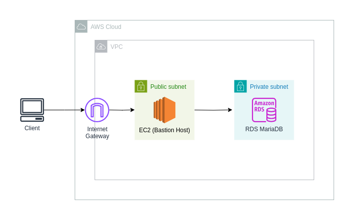

# Terraform AWS RDS with Bastion Host
Terraform code to create an RDS MariaDB instance, allowing access only from your IP address through an EC2 instance bastion host.

### Requirements
- [AWS Account](https://docs.aws.amazon.com/accounts/latest/reference/manage-acct-creating.html)
- [Terraform](https://developer.hashicorp.com/terraform/tutorials/aws-get-started/install-cli)
- [MariaDB Client](https://mariadb.com/docs/server/connect/clients/mariadb-client/#Installation)

### Set Up
1. Copy the content of `terraform.tfvars.sample` into a new file called `terraform.tfvars` and replace values with desired ones. 
2. `terraform init`
3. `terraform plan`
4. `terraform apply`

**WARNING**: This repo uses `us-west-2` region, you might need to change EC2 instance AMI for a different one if you use another region.

Once resources created, you will see `ec2-key.pem` file created in the root of the repo, it will be used for SSH access to the bastion host.

5. Start SSH tunnel
```bash
ssh -i ec2-key.pem -f ec2-user@$(terraform output -raw bastion_public_ip) -L 3306:$(terraform output -raw rds_endpoint) -N
```

6. Connect to db instance (will prompt for password)
```bash
mariadb -h 127.0.0.1 -P 3306 -u <username> -p
``` 

### Clean Up
Execute:
```bash
terraform destroy
```

### Architecture
